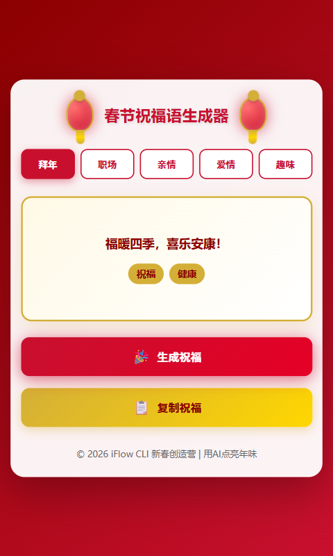

# 🧧 春节祝福语生成器

一个实用的春节祝福语生成器，提供5大主题、165条精选祝福语，帮助用户快速生成个性化祝福语。

## ✨ 功能特性

- **5大主题可选**：拜年、职场、亲情、爱情、趣味
- **165条精选祝福语**：每个主题33条，内容丰富多样
- **一键生成**：智能随机算法，快速生成祝福语
- **打字机效果**：祝福语逐字显示，增加趣味性
- **一键复制**：快速复制到剪贴板，方便分享
- **标签分类**：每条祝福语带标签，方便识别主题
- **防重复机制**：智能避免短时间内重复生成
- **精美视觉设计**：中国红+金色主题，灯笼装饰
- **流畅动画效果**：灯笼摆动、按钮发光、打字机效果
- **响应式设计**：完美适配桌面、平板、手机

## 🎨 技术栈

- **HTML5** - 页面结构
- **CSS3** - 样式和动画
- **JavaScript (ES6+)** - 核心逻辑
- **纯前端实现** - 无需后端，即开即用

## 🚀 快速开始

### 在线体验

**演示网站**：http://cods.gleeze.com/spring-festival-blessing-generator/

### 方式一：直接用浏览器打开

```
file:///C:/Users/bbylw/Desktop/nav/iflow/spring-festival-blessing-generator/index.html
```

### 方式二：使用本地HTTP服务器

```powershell
cd C:\Users\bbylw\Desktop\nav\iflow\spring-festival-blessing-generator
python -m http.server 8888
```

然后访问：`http://localhost:8888/index.html`

### 方式三：部署到 GitHub Pages

```powershell
# 1. 初始化 Git 仓库
git init

# 2. 添加文件并提交
git add .
git commit -m "feat: 春节祝福语生成器"

# 3. 推送到 GitHub
git remote add origin https://github.com/mxpus521/spring-festival-blessing-generator.git
git branch -M main
git push -u origin main

# 4. 在 GitHub 仓库设置中启用 GitHub Pages
# Settings → Pages → Source: main branch → Save
```

## 📁 项目结构

```
spring-festival-blessing-generator/
├── index.html              # 主页面结构
├── styles.css              # 样式和动画
├── script.js               # 核心逻辑和数据（165条祝福语）
├── 截图-desktop.png        # 桌面端效果截图
├── 截图-tablet.png         # 平板端效果截图
├── 截图-mobile.png         # 手机端效果截图
├── README.md               # 项目说明
└── 论坛发布帖.md           # 论坛发布内容
```

## 📖 使用说明

1. **选择主题**：点击顶部的主题按钮（拜年、职场、亲情、爱情、趣味）
2. **生成祝福**：点击"生成祝福"按钮，随机生成一条祝福语
3. **复制分享**：点击"复制祝福"按钮，复制到剪贴板
4. **重复生成**：可多次点击生成，系统会避免短时间内重复

## 🎯 主题说明

| 主题 | 说明 | 适用场景 |
|------|------|----------|
| 拜年 | 传统春节祝福 | 长辈、同事、客户 |
| 职场 | 事业升职祝福 | 上司、同事、合作伙伴 |
| 亲情 | 家庭健康祝福 | 父母、家人、亲戚 |
| 爱情 | 甜蜜浪漫祝福 | 情侣、伴侣 |
| 趣味 | 幽默风趣祝福 | 朋友、同学 |

## 🎨 设计特色

### 色彩方案
- **主色调**：中国红 (#C8102E)
- **辅助色**：金色 (#D4AF37)
- **背景色**：深红渐变 (#8B0000 → #C8102E)
- **卡片背景**：米白 (#FFF9E6)

### 动画效果
- 灯笼摆动动画（3秒循环）
- 打字机效果（逐字显示）
- 按钮发光呼吸效果（2秒循环）
- 卡片淡入效果
- Toast 提示动画

### 响应式设计
- **桌面端** (≥1024px)：完整布局，灯笼装饰
- **平板端** (768px-1023px)：标签自动换行，按钮并排
- **手机端** (≤767px)：垂直布局，按钮堆叠，触摸友好

## 📊 数据统计

- **总祝福语数**：165条
- **主题数量**：5个
- **每主题祝福语**：33条
- **标签数量**：10个
- **防重复记忆**：最近20条

## 🛠️ 开发说明

### 核心算法

祝福语生成使用 `BlessingGenerator` 类，实现防重复机制：

```javascript
class BlessingGenerator {
  constructor() {
    this.history = new Set();
  }
  
  generate(category) {
    // 随机选择祝福语
    // 避免重复（最多记忆20条）
    // 超过20条自动清理
  }
}
```

### 数据结构

```javascript
const blessings = {
  newYear: [
    { text: "新春快乐，万事如意！", tags: ["通用", "传统"] },
    // ... 更多祝福语
  ],
  // ... 其他主题
};
```

## 📸 效果展示

### 桌面端


### 平板端


### 手机端


## 🎊 使用场景

- 给长辈拜年发祝福
- 给同事客户送祝福
- 给家人亲友送温暖
- 给情侣表达爱意
- 给朋友送上幽默祝福

## 📝 更新日志

### v1.0.0 (2026-02-06)
- ✅ 初始版本发布
- ✅ 5大主题，165条祝福语
- ✅ 完整的视觉设计和动画效果
- ✅ 响应式设计
- ✅ 防重复机制

## 🙏 致谢

- **iFlow CLI 新春创造营** - 提供开发工具和活动支持
- **开源社区** - 提供各种技术资源和灵感

## 📄 许可证

MIT License

## 🤝 贡献

欢迎提交 Issue 和 Pull Request！

## 📧 联系方式

- **项目地址**：https://github.com/mxpus521/spring-festival-blessing-generator
- **演示网站**：http://cods.gleeze.com/spring-festival-blessing-generator/
- **作者**：iFlow CLI 社区
- **活动**：iFlow CLI 2026 新春创造营

---

**用 AI 点亮年味，让祝福温暖寒冬！** 🎉🧧